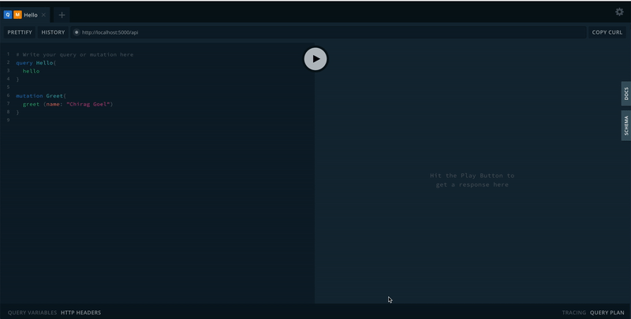

## Apollo Graphql Express Server Setup

This is the Express integration of GraphQL Server. Apollo Server is a community-maintained open-source GraphQL server that works with many Node.js HTTP server frameworks. [Read the docs](https://www.apollographql.com/docs/apollo-server/)

### Start server
```shell
npm start
```

Above script will start GraphQl server and link it with `/api` path of express server running at `5000` port (default as per code).
Now you can start testing your GraphQl implementation - `http://localhost:5000/api`.



Author: [Chirag Goel](http://www.chirag-goel.in)
